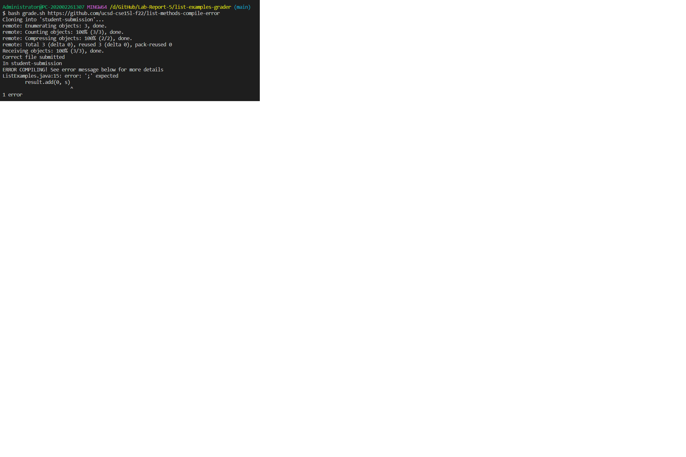
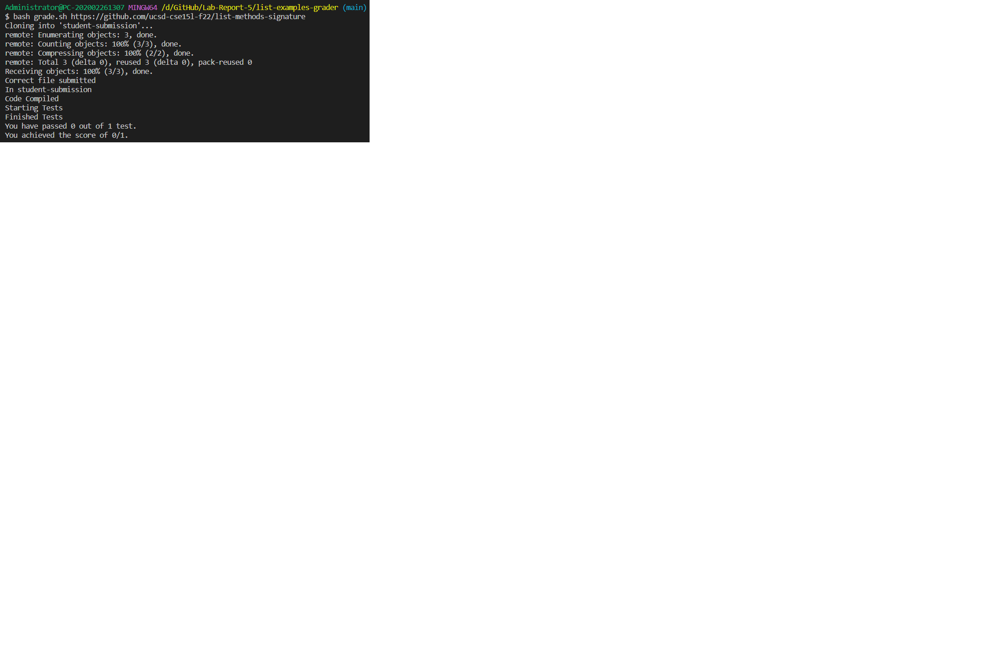
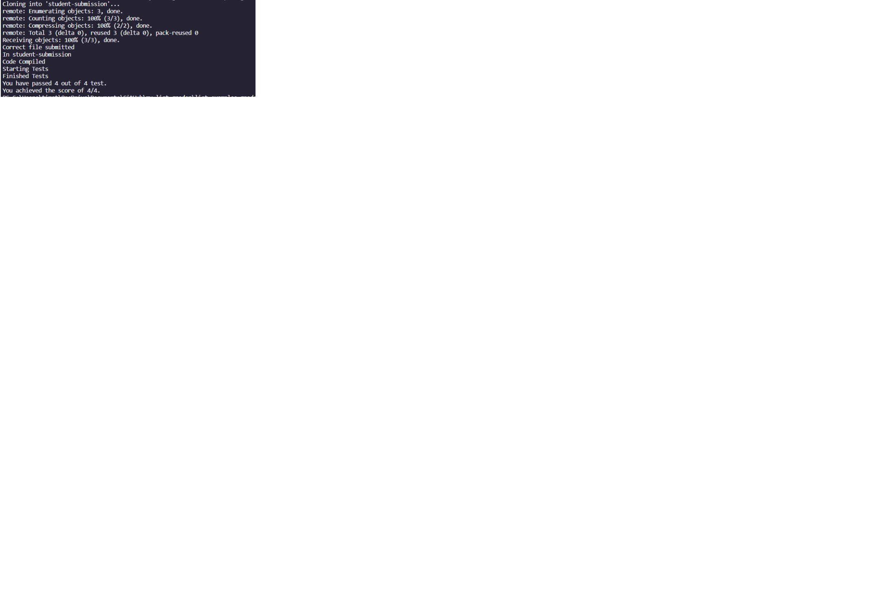

# **Lab Report 5**
### ***Acknowledgement: I want to thank my classmate Timothy Nyguen who helped me generously to write grade.sh. In addition, Timothy instructed me how to trace my grading example.*** 

<br>

## Part 1 grade.sh:
```
# Create your grading script here

CP=".;lib/hamcrest-core-1.3.jar;lib/junit-4.13.2.jar"

rm -rf student-submission
git clone $1 student-submission
cp TestListExamples.java student-submission/
cp -r lib student-submission/

if [[ -e student-submission/ListExamples.java ]]
then
    echo "Correct file submitted"
else
    echo "Wrong file submittied"
    exit
fi

cd student-submission/
echo "In student-submission"

javac -cp $CP *.java 2> compiler_output.txt

# Checking if there are any compiling errors
if [[ $? -eq "0" ]]
then
    echo "Code Compiled"	
else
	echo "ERROR COMPILING! See error message below for more details"
	cat compiler_output.txt
	exit
fi

echo "Starting Tests"
java -cp $CP org.junit.runner.JUnitCore TestListExamples > testResults.txt
echo "Finished Tests"

awk -F\. '{print NF-1}' testResults.txt > temp.txt
NUMTOTAL=$(sed -e '1d;3,$d' temp.txt)
awk -F\E '{print NF-1}' testResults.txt > temp.txt
NUMFAIL=$(sed -e '1d;3,$d' temp.txt)
awk -F '[: ]' 'index($1, "test") {print $1}' temp.txt > testsFailed.txt

NUMPASS=$(($NUMTOTAL - $NUMFAIL))

echo "You have passed $NUMPASS out of $NUMTOTAL test."
echo "You achieved the score of $NUMPASS/$NUMTOTAL."
``` 

<br>

## Part 2 Grading three different submissions:

- ## Example 1: grading https://github.com/ucsd-cse15l-f22/list-methods-compile-error


<br>

- ## Example 2: grading https://github.com/ucsd-cse15l-f22/list-methods-signature


<br>

- ## Example 3: grading https://github.com/ucsd-cse15l-f22/list-methods-corrected


<br>

## Part 3 Tracing the third grading example: 

<br>

## Firstly, the bash script first removes all folders called student-submission. Then, it git clones the inputted url and names it student-submission. After that, it copies the TestListExamples.java to the student-submission folder and Junit Lib folder to the student-submission folder.   

## After that, the script will check if the student-submission folder contains the ListExamples.java file . If it is, the it will print out "Correct file submitted." If not, it will print out "Wrong file submittied."

## Then, the script changes directory to student-submission/ and prints it is "In student-submission." After that, it compiles all java files in the folder and put the stderr into a the compiler_output.txt file. Since there is no stderr in the compiler_output.txt file in this submission, it will print out that the code compiled. If there is stderr, it will print out a warning and the compile error.

## After this, the script will print "Starting Tests" and run TestListExamples in student-submission/. Once it finishes running, it will print out "Finished Tests."

## Eventually, the script will keep track of the total number of tests, the number of tests failed, and the number of passed tests (by calculating the total number of tests - the number of failed tests). After that, the script will print out how many tests are passed out of the total number of tests and gives feedback on the score achieved.

<br>

## ***End of the lab report***
## ***Thank you for supporting me and good luck with everything :)***


